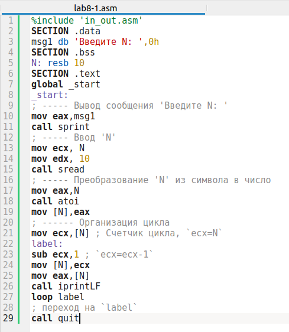
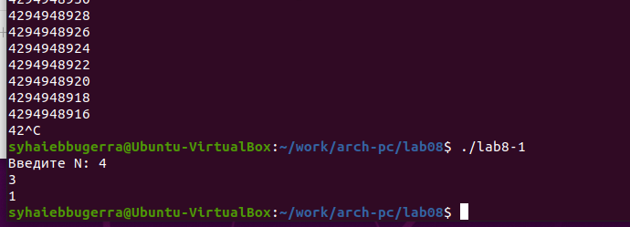
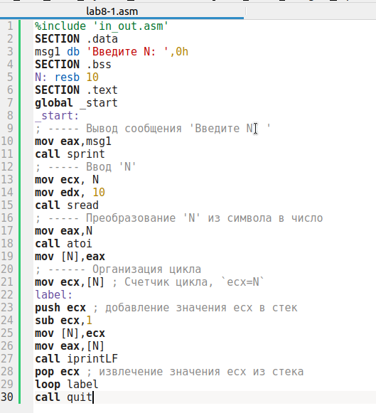
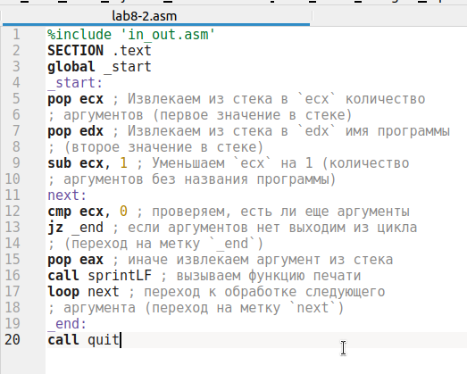
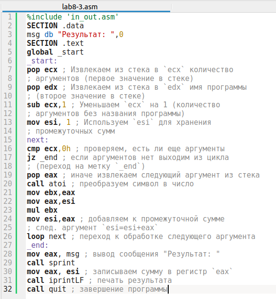
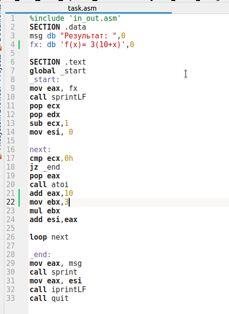

---
## Front matter
title: "Отчёт по лабораторной работе 8"
subtitle: "Архитектура компьютера"
author: "Бугерра Сухайеб"

## Generic otions
lang: ru-RU
toc-title: "Содержание"

## Bibliography
bibliography: bib/cite.bib
csl: pandoc/csl/gost-r-7-0-5-2008-numeric.csl

## Pdf output format
toc: true # Table of contents
toc-depth: 2
lof: true # List of figures
lot: true # List of tables
fontsize: 12pt
linestretch: 1.5
papersize: a4
documentclass: scrreprt
## I18n polyglossia
polyglossia-lang:
  name: russian
  options:
	- spelling=modern
	- babelshorthands=true
polyglossia-otherlangs:
  name: english
## I18n babel
babel-lang: russian
babel-otherlangs: english
## Fonts
mainfont: PT Serif
romanfont: PT Serif
sansfont: PT Sans
monofont: PT Mono
mainfontoptions: Ligatures=TeX
romanfontoptions: Ligatures=TeX
sansfontoptions: Ligatures=TeX,Scale=MatchLowercase
monofontoptions: Scale=MatchLowercase,Scale=0.9
## Biblatex
biblatex: true
biblio-style: "gost-numeric"
biblatexoptions:
  - parentracker=true
  - backend=biber
  - hyperref=auto
  - language=auto
  - autolang=other*
  - citestyle=gost-numeric
## Pandoc-crossref LaTeX customization
figureTitle: "Рис."
tableTitle: "Таблица"
listingTitle: "Листинг"
lofTitle: "Список иллюстраций"
lotTitle: "Список таблиц"
lolTitle: "Листинги"
## Misc options
indent: true
header-includes:
  - \usepackage{indentfirst}
  - \usepackage{float} # keep figures where there are in the text
  - \floatplacement{figure}{H} # keep figures where there are in the text
---

# Цель работы

Целью работы является приобретение навыков написания программ с использованием циклов и обработкой аргументов командной строки..

# Выполнение лабораторной работы

## Hеализация циклов в NASM

Создал каталог для программам лабораторной работы № 8 и файл lab8-1.asm

При реализации циклов в NASM с использованием инструкции loop необходимо помнить
о том, что эта инструкция использует регистр ecx в качестве счетчика и на каждом шаге
уменьшает его значение на единицу. В качестве примера рассмотрим программу, которая
выводит значение регистра ecx. 

Написал в файл lab8-1.asm текст программы из листинга 8.1. 
Создал исполняемый файл и проверил его работу.

{ #fig:001 width=70%, height=70% }

{ #fig:002 width=70%, height=70% }

Данный пример показывает, что использование регистра ecx в теле цилка
loop может привести к некорректной работе программы. Изменил текст программы добавив изменение значение регистра ecx в цикле.

Программа запускает бесконечный цикл при нечетном N и выводит только нечетные числа при четном N.

{ #fig:003 width=70%, height=70% }

{ #fig:004 width=70%, height=70% }

Для использования регистра ecx в цикле и сохранения корректности работы
программы можно использовать стек. Внес изменения в текст программы
добавив команды push и pop (добавления в стек и извлечения из стека) для
сохранения значения счетчика цикла loop. Создал исполняемый файл и проверьте его работу. 

Программа выводит числа от N-1 до 0, число проходов цикла соответсвует N.

{ #fig:005 width=70%, height=70% }

{ #fig:006 width=70%, height=70% }

## Обработка аргументов командной строки

Создал файл lab8-2.asm в каталоге ~/work/arch-pc/lab08 и ввел в него текст программы из листинга 8.2.

Создал исполняемый файл и запустил его, указав аргументы.
Программа обработала 4 аргумента. Аргументами считаются слова/числа, разделенные пробелом.

{ #fig:007 width=70%, height=70% }

{ #fig:008 width=70%, height=70% }

Рассмотрим еще один пример программы которая выводит сумму чисел,
которые передаются в программу как аргументы.

{ #fig:009 width=70%, height=70% }

{ #fig:010 width=70%, height=70% }

Изменл текст программы из листинга 8.3 для вычисления произведения
аргументов командной строки.

{ #fig:011 width=70%, height=70% }

{ #fig:012 width=70%, height=70% }

## Задание для самостоятельной работы

Напишите программу, которая находит сумму значений функции $f(x)$ для $x = x_1, x_2, ..., x_n$, 
т.е. программа должна выводить значение $f(x_1) + f(x_2)+ ... +f(x_n)$. 
Значения $x$ передаются как аргументы. 
Вид функции $f(x)$ выбрать из таблицы 8.1 вариантов заданий в соответствии с вариантом, 
полученным при выполнении лабораторной работы № 7. 
Создайте исполняемый файл и проверьте его работу на нескольких наборах $x$.

для варианта 20 $f(x) = 3(10+x)$

{ #fig:013 width=70%, height=70% }

Для проверки я запустил сначала с одним аргументом. 
Так, при подстановке $f(0)=30, f(1)=33$

Затем подал несколько аргументов и получил сумму значений функции.

{ #fig:014 width=70%, height=70% }

# Выводы

Освоили работы со стеком, циклом и аргументами на ассемблере nasm.